# SGI 2022/2023

## Group T03G11
| Name                        | Number    | E-Mail                   |
| --------------------------- | --------- | ------------------------ |
| Francisco Pinto de Oliveira | 201907361 | up201907361@edu.fe.up.pt |
| Marcelo Henriques Couto     | 201906086 | up201906086@edu.fe.up.pt |

----

## Projects

### [TP1 - Scene Graph](tp1)

#### Strong Points 
- Variety of objects
- Multitude of prespectives and scales
- Interesting usage of component references

#### Scene Description - Glitched Bakery

- The scenario described in the scene aludes to a misterious bakery 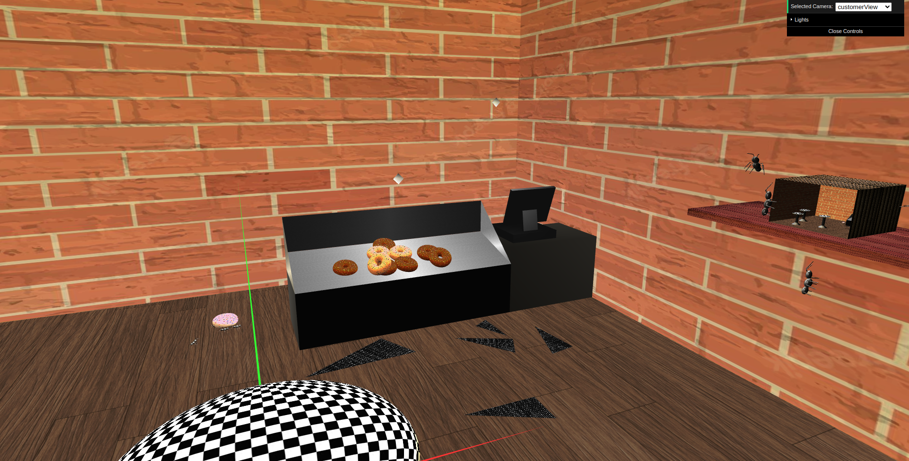 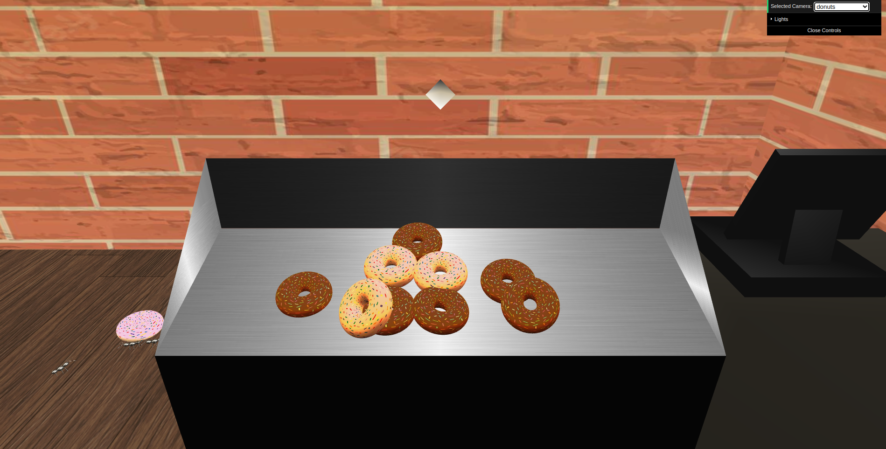 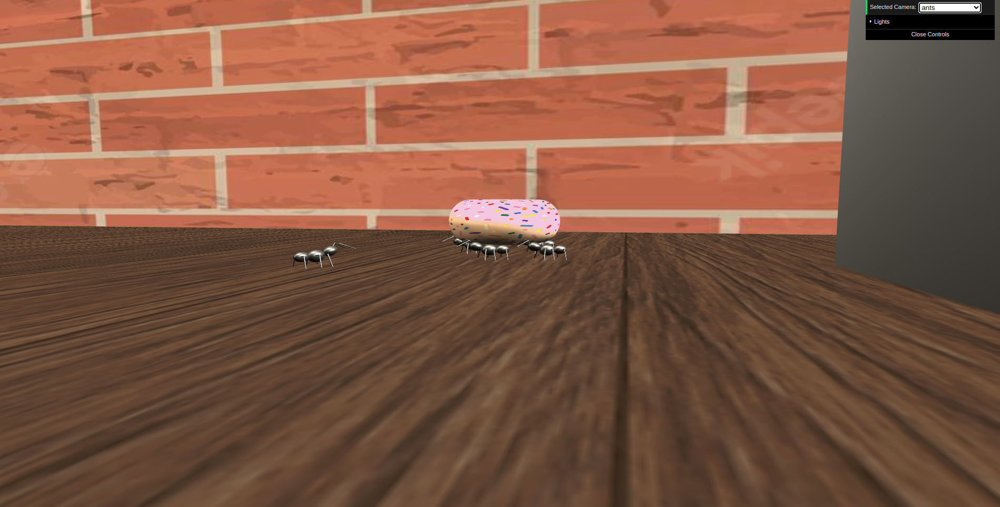 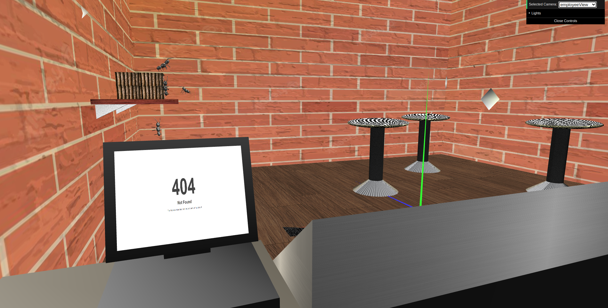 
- which exists in a world created by a computer simulation ... 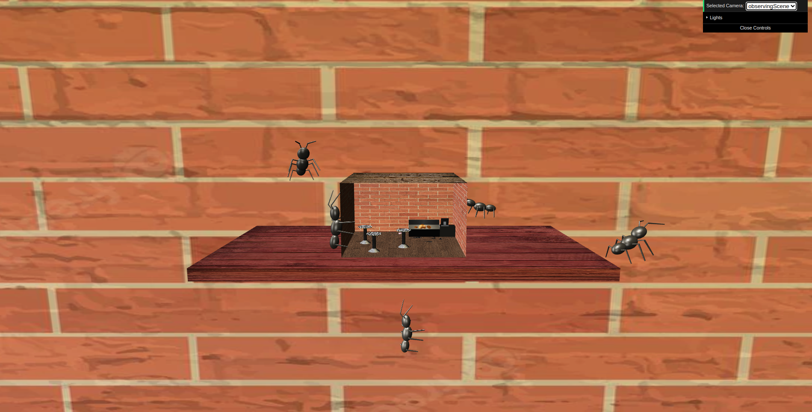
- ... that has glitched and is full of bugs ... 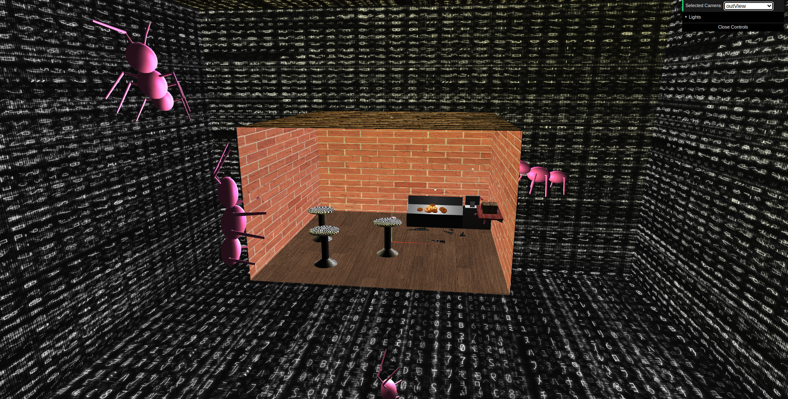 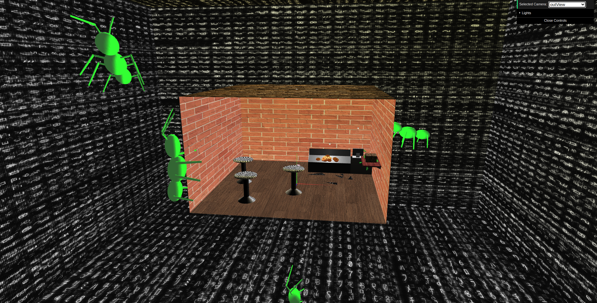 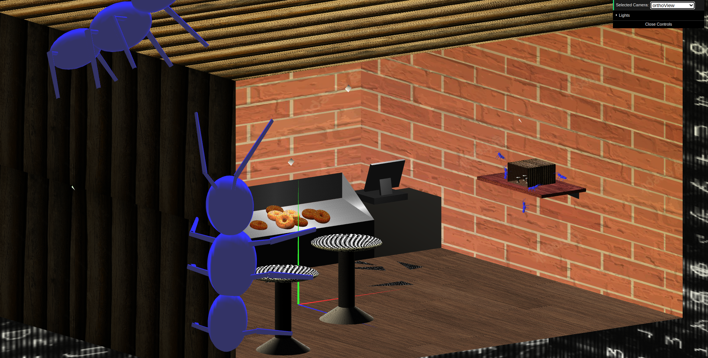

[Link to Scene](tp1/scenes/SGI_TP1_XML_T03_G11_v03.xml)

-----

### [TP2 - NURBS, animations and shaders](tp2)
#### Strong Points
 - Our animations are synchronized to produce a bigger animation
 - Creativity at the choice of textures
 - We used creactive freedom to improve the highlight shader so that the texture color still appears.
 - We grouped all primitives that were children of a same component to minimize the number of shader swaps. 

#### Scene Description - Glitched Bakery
  - Overall view of our bakery (now with minecraft textures)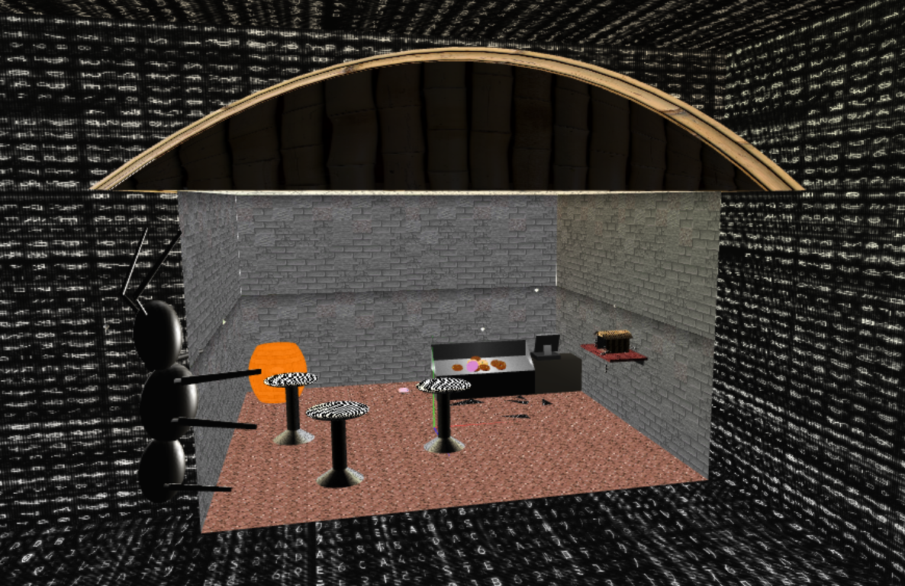
  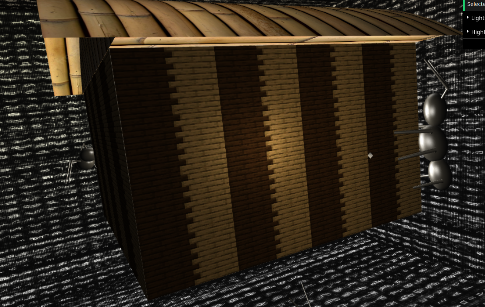
  - Out of nowhere an ant was abducted
  - Oh no! There is a barrel ready to explode, maybe the ant abduction was good afterall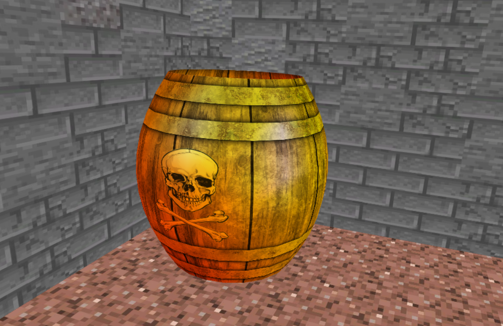

[Link to Scene](tp2/scenes/SGI_TP1_XML_T03_G11_v03.xml)
----

### [TP3 - ...](tp3)
- (items briefly describing main strong points)

