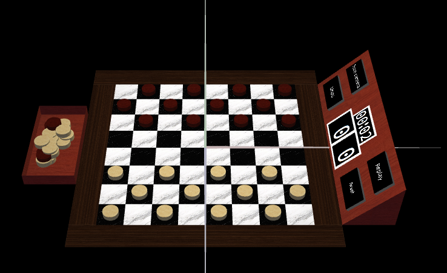
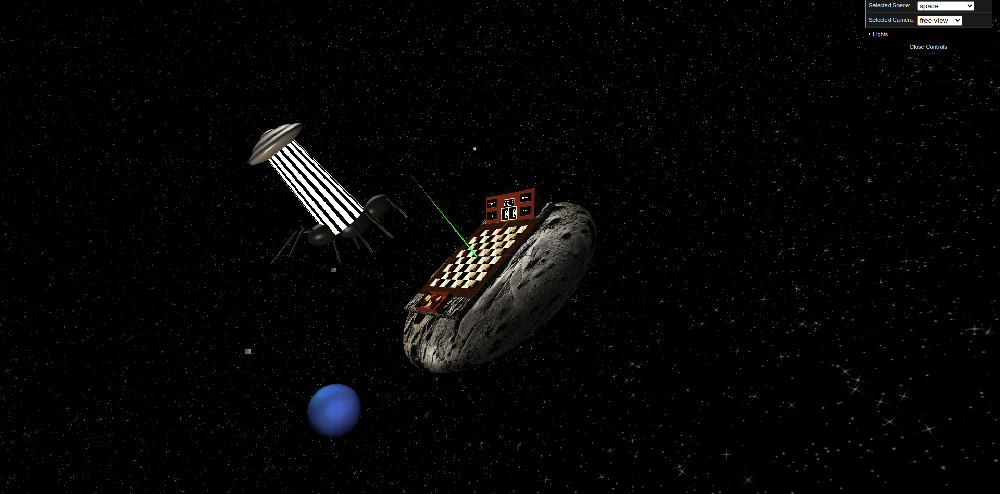
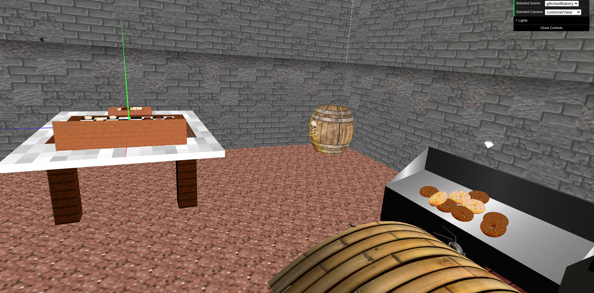
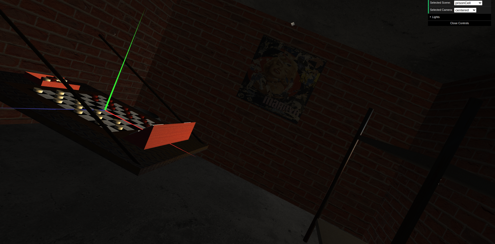

# SGI 2022/2023 - TP3

## Group T03G11

| Name                        | Number    | E-Mail                   |
| --------------------------- | --------- | ------------------------ |
| Francisco Pinto de Oliveira | 201907361 | up201907361@edu.fe.up.pt |
| Marcelo Henriques Couto     | 201906086 | up201906086@edu.fe.up.pt |

----

## Project information

- 3 Different scenarios to play on despite the void default one
- Smooth animations
- Classical look and feel to the game
- testScene
  - void default scene
  - 
- space
  - scene with planets, giant ants being abducted and a starry night sky
  - 
- glitchedBakery
  - a glitched bakery lost in the matrix (scene from other TP changed)
  - 
- prisonCell
  - play checkers in an old scary prison cell
  - 
----
## Issues/Problems

- There are no apparent bugs, all functionalities were implemented
----

## Instructions
Instructions for the usage of the program can be found in [this link](./MANUAL.md).